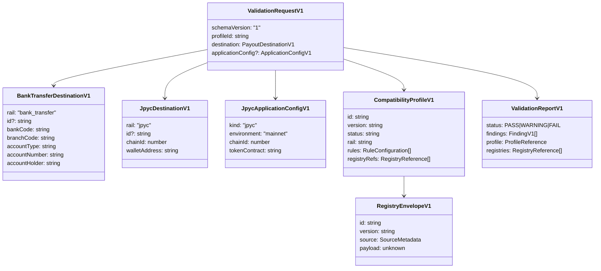

# 03 — Domain Model

## 1. Core relationship

```text
Destination
    ×
Compatibility Profile
    ×
Registry Snapshot
    ↓
Rule Engine
    ↓
Validation Report
```

「日本の銀行口座として正しいか」という単一真偽値ではなく、**選択したProfileとRegistry versionに対して互換か**を判定する。

## 2. Aggregate model



## 3. Destination

### 3.1 BankTransferDestination

受取人が支払先として登録する銀行情報。文字列は、先頭ゼロと原入力を保持するためnumberにしない。

Invariants:

- `bankCode`, `branchCode`, `accountNumber` are strings.
- 入力schemaはrail固有fieldを要求する。
- account holderを正規化済みと仮定しない。
- domain object自体は「有効」と保証しない。Rule Engineで評価する。

### 3.2 JpycDestination

受取人が指定したEVM walletと希望chain。

Invariants:

- `chainId`はnumberだが、対応可否はRegistryで決める。
- `walletAddress`の所有を保証しない。
- token contractは受取人情報ではなく、application/configurationまたはProfile Registry側の情報。

## 4. Application configuration

v0.1ではJPYCのみ定義する。

`JpycApplicationConfigV1`は、顧客アプリが使用するchainとtoken contractの組を表す。CLIの明示入力またはscannerが発見したcandidateから検証する。

DestinationとApplication Configを同時に検証する場合、両者の`chainId`は一致しなければならない。

これはtransaction設定ではない。RPC URL、private key、gas policyは持たせない。

## 5. Compatibility Profile

Profileはruleの集合とparameterを持つ。

例：

```text
bank-generic-jp@0.1.0
jpyc-current-mainnet@2026.09.02
zengin-fb-draft@0.1.0-experimental
```

Profileが決めるもの：

- 適用rail
- enabled rule IDs
- default severity override
- field constraints
- required Registry versions or compatible ranges
- status (`verified`, `experimental`, `deprecated`)

Profileに実データ一覧を直接埋め込まず、Registryを参照する。

## 6. Registry

Registryは変更し得る参照データのversion固定snapshot。

### Bank Registry

- bank code
- bank names for operator diagnostics
- branch code
- branch-bank relation
- source/provenance

### JPYC Registry

- environment
- network name
- chain ID
- current official token contract
- status
- source/provenance

## 7. Rule

Ruleは副作用を持たない。

```text
Rule(Context) -> Finding[]
```

Ruleが行わないこと：

- file I/O
- network I/O
- logging
- process exit
- clock/randomへの依存
- raw sensitive dataのrendering

## 8. Finding

Findingは次を最低限持つ。

- stable `ruleId`
- `severity`
- machine-readable `messageKey`
- human-readable `message`
- structured `path`
- safe `location`
- optional `expected`
- redacted/derived `actual`
- optional `suggestion`
- optional `documentationUrl`

## 9. Status aggregation

```text
if any(error)   => FAIL
else if warning => WARNING
else            => PASS
```

Batch reportはitem statusと全体statusを持つ。全体statusは最も重いitem status。

## 10. Validation lifecycle

```text
Raw input
  ↓ runtime schema parse
Canonical request
  ↓ profile resolution
Profile
  ↓ registry resolution and integrity check
Validation context
  ↓ deterministic rules
Unsorted findings
  ↓ redaction and stable sort
Item report
  ↓ aggregate
Validation report
  ↓ renderer
Text / JSON / SARIF / JUnit / GitHub annotations
```

## 11. Batch model

JSON/YAML batchはmixed railを許可できるが、各itemが`profileId`を明示する。

CSV v0.1は単一rail・単一profileのみ。CLI flagでrail/profileを与え、canonical headerを使用する。

## 12. Invariants across the system

1. Validation result is tied to explicit tool/Profile/Registry versions.
2. Raw secrets and sensitive destination values are never required in report output.
3. Unknown data does not become a false assertion.
4. Registry staleness is visible in metadata.
5. An experimental Profile cannot masquerade as verified.
6. Scanner candidates are not equivalent to parsed configuration unless confidence is `structured`.
