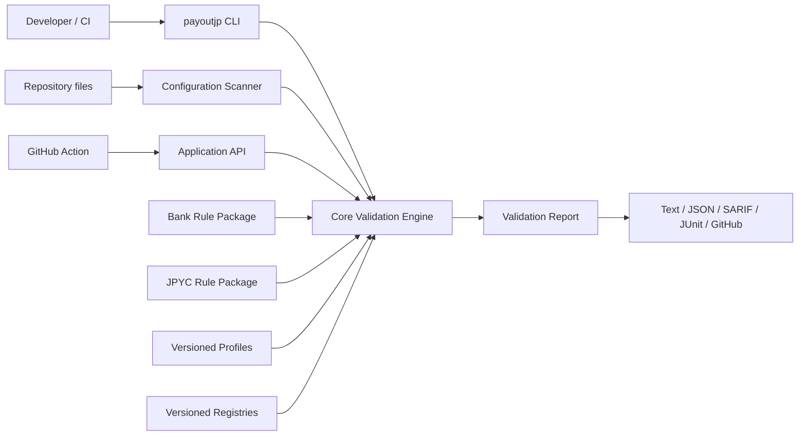
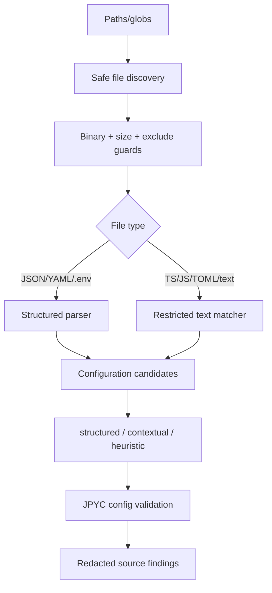

# 04 — Architecture

## 0. Implementation status

This document describes a candidate target-state architecture. M0 creates all six package
boundaries, but `jpyc`, `scanner`, and `action` remain buildable placeholders. The first feature
slice is expected to use no more than `core + bank + cli`; a normal CI step can invoke the CLI
without requiring a dedicated GitHub Action.

Stable package boundaries let deferred modules be added later without coupling them into Core.

## 1. Architecture style

- Local-first
- Library-first
- Deterministic rule engine
- Versioned data packs
- Thin CLI and GitHub Action adapters
- No runtime network dependency

## 2. System context



No arrow is allowed from validation components to an external network.

## 3. Package layout

| Package | Responsibility | May depend on |
|---|---|---|
| `@payoutjp/core` | schemas, rule interfaces, engine, reports, redaction | Zod and small utility deps |
| `@payoutjp/bank` | bank destination schema, bank rules, bank profiles | core |
| `@payoutjp/jpyc` | JPYC schema, JPYC rules, official registry loaders | core, viem pure utilities |
| `@payoutjp/scanner` | safe file discovery and JPYC configuration candidates | core, jpyc |
| `@payoutjp/cli` | input loading, command parsing, rendering, exit codes | core, bank, jpyc, scanner |
| `@payoutjp/action` | GitHub Actions adapter and annotations | public application API; no duplicated rules |

## 4. Dependency constraints

```text
core <- bank
core <- jpyc
core + jpyc <- scanner
core + bank + jpyc + scanner <- cli
application API <- action
```

Hard constraints:

- `core` cannot import bank, jpyc, scanner, cli, or action.
- rule packages cannot read files or print output.
- CLI and Action cannot define business rules.
- library packages cannot call `process.exit()`.
- renderer code cannot mutate findings.

## 5. Core engine

### Inputs

- canonical validation request
- resolved Compatibility Profile
- resolved Registry snapshots
- list of applicable pure rules

### Processing

1. Validate request schema.
2. Resolve Profile by exact ID/version.
3. Resolve and integrity-check Registry references.
4. Build immutable validation context.
5. Select rules enabled by Profile.
6. Execute rules in stable rule ID order.
7. Convert internal values to privacy-safe findings.
8. Stable-sort findings.
9. Aggregate item and report status.

### Outputs

- `ValidationReportV1`
- application error for malformed configuration or missing data pack

## 6. Application API

CLI and Action should use a small facade rather than assembling packages separately.

Conceptual API:

```ts
export interface PayoutJpApplication {
  validate(request: unknown, options?: ValidateOptions): ValidationReportV1;
  audit(request: unknown, options?: AuditOptions): ValidationReportV1;
  scan(input: ScanRequestV1): ScanReportV1;
  listProfiles(): ProfileSummaryV1[];
  getRegistryStatus(): RegistryStatusV1[];
}
```

This API remains synchronous where practical because all data is local. File discovery and file reads may use async adapters.

## 7. Registry/Profile loading

Data packs are loaded from:

1. explicit CLI/config path;
2. package-bundled verified data;
3. package-bundled experimental data only when explicitly enabled.

Resolution must be exact and reproducible. Do not silently fetch a newer Registry.

```text
profileId -> profile version -> required registry IDs/versions -> digest check
```

## 8. Scanner architecture



Scanner never imports, evaluates, bundles, or executes customer code.

## 9. GitHub Action architecture

- JavaScript Action, Node.js 24 runtime.
- User performs checkout before the action.
- Action reads local files only.
- Action calls the same application API as CLI.
- Findings are mapped to annotations.
- Report summary is written to GitHub Step Summary.
- Action bundle is generated and committed for normal GitHub Action distribution.

PR comments and GitHub App webhooks are outside v0.1.

## 10. Error taxonomy

### User/input errors

Examples:

- invalid JSON/YAML/CSV
- invalid `payoutjp.config.yml`
- Profile not found
- Registry digest mismatch
- unsupported output format

Mapped to CLI exit code `2` or `4` as specified.

### Validation findings

Expected domain output. They do not throw exceptions.

### Internal errors

Unexpected invariant violations, file system failures, or bugs. Mapped to exit code `3`; output must remain redacted.

## 11. Determinism

The following must not influence report content unless explicitly injected:

- current time
- random IDs
- host absolute path
- file enumeration order
- object insertion order
- locale of the host OS

Use normalized relative paths and stable sorting.

`generatedAt` is omitted from canonical report v0.1. Renderers may show a runtime timestamp only outside canonical JSON.

## 12. Performance targets

Initial non-binding budgets:

| Operation | Target |
|---|---:|
| Single destination validation | < 20 ms after process startup |
| 10,000 canonical rows | < 5 s on a typical hosted CI runner |
| Source scan | bounded by 5 MB/file and configured path count |
| Action bundle | Prefer < 10 MB uncompressed |

Correctness, privacy, and determinism take priority over micro-optimization.

## 13. No-network enforcement

- Domain packages must not depend on HTTP/RPC clients.
- Tests run with network disabled or intercepted where feasible.
- `viem` may be used only for address utilities; no transports/clients.
- Update scripts, if later added, live outside validation runtime and require explicit invocation.

## 14. Future data-pack boundary

The architecture should allow:

```text
Engine packages
+
separately distributed versioned Profile/Registry pack
```

However, v0.1 does not implement remote pack delivery, online entitlement checks, or encrypted packs.
Package boundaries preserve future distribution options without adding a runtime network dependency.
